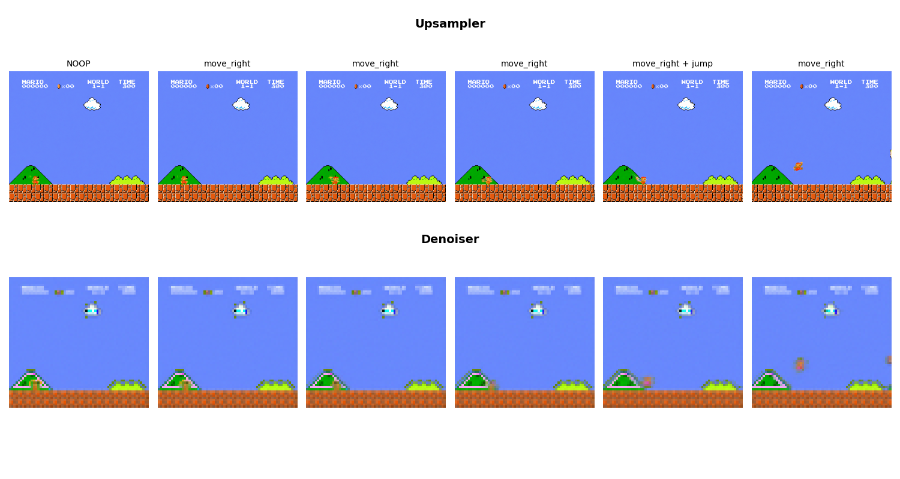
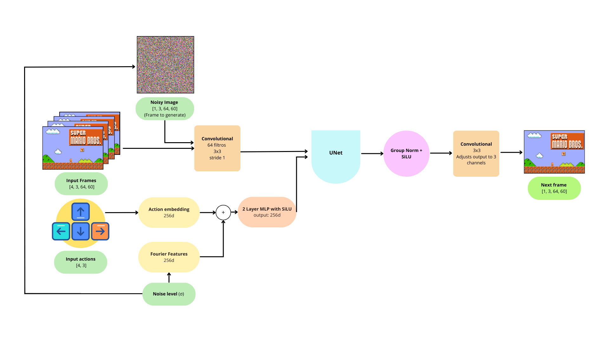
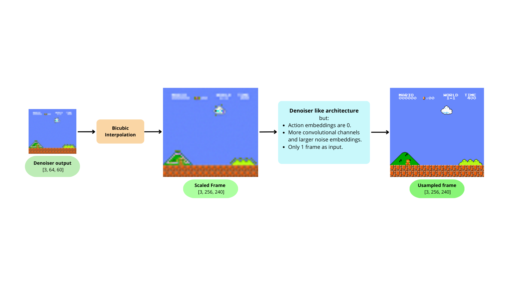
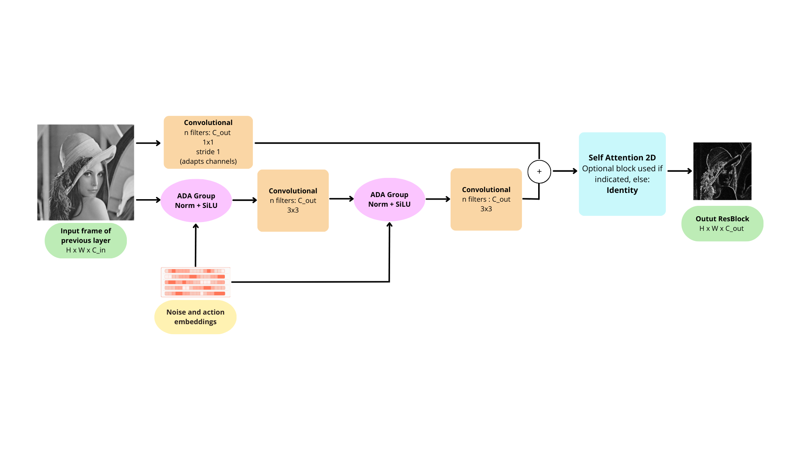

# Super Mario DIAMOND

:star: Star us on GitHub — it motivates us a lot!

[ Super Mario DIAMOND](https://github.com/AlexBodner/DIAMOND_SuperMario) is an open source project that applied [DIAMOND](https://github.com/eloialonso/diamond) for [Super Mario Bros Gym environment](https://pypi.org/project/gym-super-mario-bros/). We replace the whole game engine by a neural network, which emulates the dynamic of the videogame, predicting the next frame out of previous states and actions. Take a look at an example:

## Table Of Contents

- [Installation and Usage](#Installation-and-Usage)

- [Datasets](#Datasets)

- [Train your own model](#Train-your-own-model)

- [Architecture](#architecture)

- [Collaborate](#Collaborate)

- [License](#license)
  
- [References](#references)

## Installation and Usage

For running the pretrained models you need to:
- Install the modules in the requirements.txt : pip install -r requirements.txt
- Generate the spawn in which you want to play (Or use any of the already given). In diamond dir run: python3 src/spawn.py folder_with_hdf5_filez/ src/ 
- Download models. Download any of oru checkpoints (or train yours) and put it in the diamond/checpoints directory. This can be changed in line 54 of play.py
- Play! In diamond dir run: python3 src/play.py --model "src"

## Datasets

We tried using AI generated datasets, by simulating games with a pretrained PPO agent, and we tried generating data by playing ourselves. By manually generating the dataset, we were able to broadly explore different scenarios, in contrast to the agent which took always the same kind of actions, even when combined with random factors. 

Our human generated dataset can be downloaded in the following [link](https://drive.google.com/file/d/1e3iiHeJRd64L6WfdF_tFuUqeufu8RMWK/view?usp=sharing)

To generate a synthetic dataset we provide 2 options. One which runs 'n' episodes providing a different random factor for each episode. And the second one which gave better results that consists in balancing the less represented classes,  but it only works if we force the agent to do that action repeated times. At the moment we only implemented the balancing of the NOOP action to test this hypothesis we had, but this can be easily extended to other actions. These dataset creations can be run with the scripts:  ai_dataset_gen.py and balanced_dataset_gen.py. They will generate the hdf5 files in the diamond/dataset_files director.

## Train your own model

We trained the model for 50 epochs, which took roughly 24 hours in a NVIDIA L4 GPU in a Google Cloud instance. Meanwhile, DIAMOND authors claim to train for 1000 epochs and with the double of data.

To train the model on new data, once you have a directory full of hdf5 files, follow these steps:

- For Train/valid split run from diamond: python src/select_test_split.py --percentage 15 dataset_files/ test_split.txt
- To convert the files to the expected format  run from diamond: python src/process_dataset_hdf5.py dataset_files/ processed
- Don't forget to modify the configs. For example the image sizes in: diamond\config\env\csgo.yaml
- For training run: python src/main.py 

The hiperparameters that we used are:

For the Denoiser:
- Batch size: 6
- Gradient accumulation steps: 6
- 50 epochs.
- First epoch steps: 1000
- steps per epoch: 500

For the Upsampler: 

- Batch size: 4
- Gradient accumulation steps: 1
- 50 epochs.
- steps per epoch: 400

## Architecture

While developing the project, we took the time to create detailed diagrams to explain and better understand the architecture. In this section you will find a short explanation and overview.

To begin with, we have the Denoiser, which is the core of the project. It takes the previous 4 frames, previous actions and  noise level of the diffusion process at that step. It then generates de next frame in the low resolution. We opted to use the same architecture as the Atari model, where we processed the Mario frames in 64x60.  This model has 4 million parameters, in contrast to the 380M used in the CSGO model.

The Fourier features is just a way of converting the noise level to an embedding. It consists in projecting the log of the noise level to a new vector using a fixed random matrix. Then, to this projection we apply the sin and cosine.

Once we have the next frame at the output of the Denoiser, we pass this frame to the Upsampler, which will convert the image to a 256x240 frame, in "high resolution". It's scheme can be visualized as follows.

The Upsampler has almost the same architecure than the Denoiser, but it only takes as input the low resolution frame. Also, here we opted to use the same architecture as the CSGO model, which has 50 million trainable parameters. This difference in parameters is backed by an increase in the number of convolutions in the Denoiser convolutional layers.

And since we are talking about the UNet, this UNet follows a very classic approach, but the authors provide a custom block to "intoxicate" the visual information with the action embeddings. The UNet applies 4 times a group of 2 "ResBlocks" with padding, which mantain the image size, and then a convolution with stride 2. In this way, each step lowers the resolution by a factor of 2. Then, it applies an inverse approach, to upsample the image. 

Let's take a look at the ResBlock. The key here is the ADA Group Norm. This block builds upon Group Normalization as proposed by Wu et al., with the additional feature that the output of the group normalization is scaled and shifted by factors learned from embeddings. 

A linear layer transforms the action and noise embeddings into the required output dimensions, applying the following formula, defined in Equation:

$$
\text{Output} = \textbf{Group Norm}(\text{Input}) \cdot (1+\sigma) + \mu

$$

Here, $\mu$ and $\sigma$ are the terms learned by the linear layer.

Finally, the ResBlock can be seen in the following Figure:

The Self Attention is only used in the last convolutional layer in the Upsampler, in the rest it is ommited.

## Collaborate

This repository aims to grow in functionalities, and your contributions are highly appreciated. if you want to contribute to the project create a fork and make a pull request with your feature. 

Some development ideas that we want to add in the future are:
- Further action balancing in more intelligent ways. For example, one could hash the frames and associate to that hash the done actions. In that way, one could take a different action if the same scenario is seen across different episodes.

If you'd like to work on this don't be shy to contact us!

## License

This project is licensed under the terms of the MIT license and is available for free.

## References

* [DIAMOND: Original work](https://diamond-wm.github.io/)
* [DIAMOND for Mario Kart](https://github.com/Dere-Wah/AI-MarioKart64)
